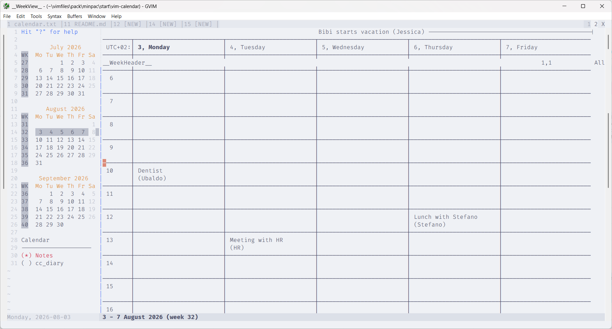

# vim-calendar

A Vim 9.0 ported, refactored and enhanced version of
[mattn/calendar-vim][1].



## What it does

- Split-window calendar display
- Events preview with `K` key,
- ISO (EU), US, and work-week (Mon–Fri) layouts
- Week view panel with calendar events integration
- Multiple configurable diary books
- Address-book completion for event attendees
- Configurable holidays

## Installation

Install with your preferred plugin manager (minpac, vim-plug, etc.).

Requires **Vim 9.0** or later.

## Usage

The best way to learn to use vim-calendar is to run `:CalendarToggle` and hit
`?`.
Note that different windows shows different helps.

#### Additional Commands

| Command | Description |
|---|---|
| `:CalendarToggle [year [month]]` | Toggle calendar tab (open / focus / close) |
| `:CalendarRefresh` | Re-fetch appointments for the visible week |
| `:CalendarSearch {keyword} [{year}]` | Search diary markdown files |
| `:CalendarWipe` | Close tab and wipe all calendar buffers |


Press `?` inside the calendar for a full key-binding reference.

#### Minimal configuration

```vim
g:calendar_config = {
  position:         'left',
  cal_type:         'eu',
  show_week_number: false,
  number_of_months: 3,
  holidays: {'2026-12-25': 'Christmas'},
  auto_create_diary_dirs: false,
  diaries_dict: {
    My_Diary: {path: '~/my_diary', resolution: 'month'},
    Notes:    {path: '~/notes',    resolution: 'day'},
  },
  active_diary: 'My_Diary',
}
```

## External calendars integration

Events in the calendar can be created, edited, stored and fetched from a
locally stored JSON file or from an external source (e.g. Google Calendar,
Apple Calendar, Outlook, etc).

Integration with Outlook works out of the box if [vim-outlook][2] is installed.
For other calendars integration some work is required.
See `:help calendar` for more info.

## Built-in event form

For a diary without custom provider hooks, press `m` in `__WeekView__` to
create or edit an event. The form supports title, start/end, required and
optional attendees, organizer, location, all-day status, and body. In either
attendee field, use `<C-X><C-O>` to complete entries from that diary's
`address_book`. Diary pages do not change `'omnifunc'`.

Press `W` to save, `Q` to discard, or `?` for form help. After a successful
local save, the plugin fires `User CalendarEventCreated` or
`User CalendarEventModified`; the saved dictionary is in `g:calendar_event`.


## Security and privacy

Calendar and address-book data may be confidential. This plugin processes
that data locally, but it does not encrypt it or provide access control.
The built-in provider stores events persistently as plaintext JSON, and
providers may create additional plaintext snapshots or cache files.

Temporary files are deleted on the normal processing path where possible,
but deletion is best-effort, is not secure erasure, and may not occur after
a crash or forced termination. Files may also be retained by backups,
indexing tools, antivirus software, or filesystem recovery mechanisms.

Use storage locations and operating-system permissions appropriate for the
data, and assess the plugin against your organization's confidentiality and
retention requirements. The software is provided "as is" under the BSD
3-Clause License.

## License

BSD-3.

<!-- DO NOT REMOVE vim-markdown-extras references DO NOT REMOVE-->

[1]: https://github.com/mattn/calendar-vim
[2]: https://github.com/ubaldot/vim-outlook
